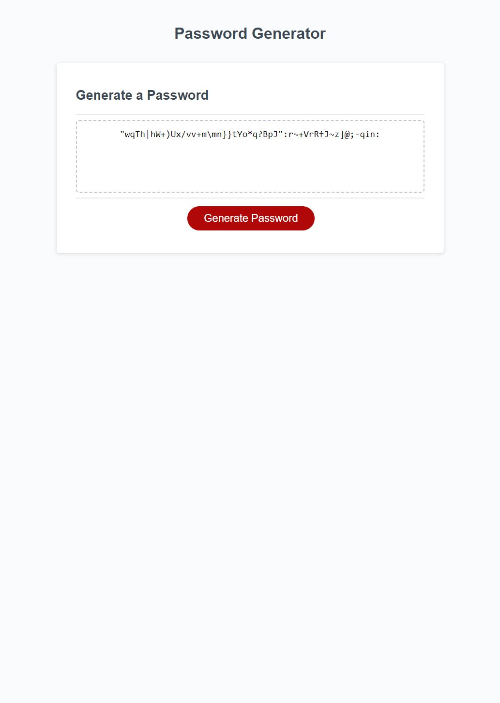

# Password-Generator

This is a password generator that has multiple options for the user to choose and make a strong password.

## Features
* Option to have Lower Case characters
* Option to have Upper Case characters
* Option to have Numbers
* Options to have Special Characters

## Screenshot

## Live Password Generator Link
[Password Generator](https://marvinjvelasco.github.io/Password-Generator/)

## Purpose

* This challenge to to demonstrate my understanding of Javascript and Console commands.
* I was able to use Variable and Arrays to list the users different options when choosing thier password.
* I used 'If' and 'for' loops to apply user settings to their password.
* I added 'EventListener' to generate action to their button.
* I added 'concat' functions to combine arrays and user settings.
* I added Math.floor(Math.random()) to randomize user settings.
